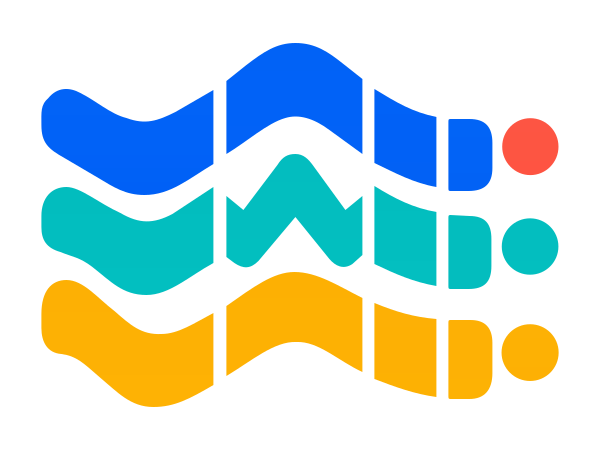

<p align="center">
  <strong>English</strong> · <a href="README_zh.md">中文</a>
</p>

<p align="center">
  
</p>

<h1 align="center">Wearable IMU Activity Segmentation Pipeline</h1>

<p align="center">
  <strong>Turn continuous wrist motion into timestamped activity records</strong><br>
  See what activity happened, when it started, and when it ended—from Python research code to a browser demo and Android app.
</p>

<p align="center">
  <a href="https://www.python.org/"></a>
  <a href="https://pytorch.org/"></a>
  <a href="android_realtime_app/"></a>
  <a href="#quick-start"></a>
  <a href="https://rudykon.github.io/Wearable-IMU-Activity-Segmentation-Pipeline/"></a>
  <a href="https://huggingface.co/spaces/config-h/Wearable-IMU-Activity-Segmentation-Pipeline"></a>
  <a href="LICENSE"></a>
</p>

<p align="center">
  <a href="https://rudykon.github.io/Wearable-IMU-Activity-Segmentation-Pipeline/">Website</a> ·
  <a href="https://huggingface.co/spaces/config-h/Wearable-IMU-Activity-Segmentation-Pipeline">Live Demo</a> ·
  <a href="#overview">Overview</a> ·
  <a href="#pipeline">Pipeline</a> ·
  <a href="#quick-start">Quick Start</a> ·
  <a href="#data">Data</a> ·
  <a href="#model-assets">Models</a> ·
  <a href="#android-app">Android</a> ·
  <a href="#reproduction">Reproduction</a> ·
  <a href="#license">License</a>
</p>

> [!IMPORTANT]
> The GitHub repository does not distribute participant sensor recordings. Repository-authored source code and the distributed Python/Android model assets are Apache-2.0; datasets and third-party dependencies retain their own terms.

<a id="overview"></a>
## Overview

### Why this project exists

A wearable inertial measurement unit (IMU) records acceleration and rotation
continuously. A one-hour session can contain hundreds of thousands of sensor
rows, but a researcher or app user usually needs a much shorter answer:

- What activity happened?
- When did it start and end?
- How many separate activity periods were there?

This project turns the continuous signal into records such as:

```text
user_id, category, start, end
```

The system looks at the same recording through 3-, 5-, and 8-second windows.
Short windows help locate activity changes; longer windows provide steadier
context. It then combines their predictions and cleans up brief interruptions,
false alarms, and shifted boundaries before writing the final record list.

### Where it can be used

- **Long-session activity-recognition research:** compare complete activity
  timelines instead of scoring isolated clips only.
- **Controlled workout logs:** create candidate records for badminton, rope
  skipping, dumbbell fly, running, and table tennis.
- **Annotation and quality review:** direct a reviewer to likely activity
  periods and uncertain boundaries.
- **Mobile deployment experiments:** collect a six-axis BLE signal and run the
  corresponding ONNX models on Android.

The repository includes the Python pipeline, fixed model assets, a free browser
demo, an Android prototype, and scripts for evaluation and reproduction. Full
training and dataset-level inference require authorized local sensor files.
The public demo uses synthetic data by default; do not upload sensitive
participant recordings to a public Space.

<a id="pipeline"></a>
## How the pipeline works

<p align="center">
  <a href="experiments/figures/fig02_overall_framework.png">
    
  </a>
</p>
<p align="center"><em>Figure 1 | The path from a continuous IMU recording to a short list of activity records.</em></p>

1. **Read the session.** Load the timestamp plus three acceleration and three
   gyroscope channels.
2. **Look at several time spans.** The 3-, 5-, and 8-second models provide
   complementary views of short transitions and sustained movement.
3. **Build a stable timeline.** Align the predictions, reduce rapid label
   flicker, join appropriate gaps, refine boundaries, and filter weak records.
4. **Return useful records.** Export the activity name, start time, and end
   time, then evaluate those records against labeled segments.

The detailed names—CNN–BiLSTM, Local-Boundary Scale Arbitration (LBSA), Viterbi
decoding, and the Temporal Record Layer (TRL)—are explained on the
[architecture page](https://rudykon.github.io/Wearable-IMU-Activity-Segmentation-Pipeline/guide/pipeline/).

<a id="quick-start"></a>
## Quick Start

```bash
git clone https://github.com/rudykon/Wearable-IMU-Activity-Segmentation-Pipeline.git
cd Wearable-IMU-Activity-Segmentation-Pipeline

conda env create -f environment.yml
conda activate imu-activity-pipeline
python -m pip install -e .
python tests/smoke_test.py
```

The smoke test checks imports, canonical paths, tiny temporary signal loading, annotation loading, and workbook writing. It does not require private raw data or trained checkpoints.

### Browser demo

The browser demo is the quickest way to understand the output. Use the built-in
synthetic session or upload a compatible 100 Hz TXT/TSV file. The page shows the
six sensor signals, the activity likelihood over time, the final start-to-end
records, and a downloadable CSV. It runs the repository's real 3-, 5-, and
8-second models.

[**Open the Hugging Face Space →**](https://huggingface.co/spaces/config-h/Wearable-IMU-Activity-Segmentation-Pipeline)

Run the same interface locally:

```bash
python -m pip install -r requirements.txt
python -m pip install spaces
python -m pip install -e .
python demo/app.py
```

For a pip-only environment, install the pinned Python dependencies first:

```bash
python -m pip install -r requirements.txt
python -m pip install -e .
```

After placing authorized data under `data/` and model assets under `saved_models/`, run inference:

```bash
python run_inference.py
```

The default split is `external_test`, and the default output is:

```text
predictions_external_test.xlsx
```

Useful root commands:

```bash
python train.py
python train_parallel.py
python evaluate.py --split external_test
python -m imu_activity_pipeline.inference \
  --data_dir data/signals/internal_eval \
  --output predictions_internal_eval.xlsx
```

See [docs/USAGE.md](docs/USAGE.md) for training, evaluation, Python interfaces, packaged executable layout, and experiment scripts.

<a id="data"></a>
## Data

The dataset is not distributed directly in this GitHub repository. This repository keeps the expected local layout and data-use instructions so authorized users can place files consistently.

| Component | Default local path | Notes |
| --- | --- | --- |
| Signal streams | `data/signals/{train,internal_eval,external_test}/` | UTF-8 tab-separated `.txt` files |
| Annotations | `data/annotations/*_annotations.csv` | `split,user_id,category,start,end` |
| Split metadata | `data/splits/`, `data/metadata/` | User lists, manifests, label summaries, dataset metadata |
| Optional public datasets | `data/public_external/` | User-downloaded assets; each dataset keeps its own license |

Until the PhysioNet repository is formally released, research-use access is requested through the Tencent Questionnaire link maintained in [data/README.md](data/README.md). After PhysioNet release, follow the PhysioNet link and citation information maintained in the repository documentation.

<a id="model-assets"></a>
## Model Assets

The Python research pipeline is code-first. Selected reproducibility checkpoints, normalization parameters, and ensemble configuration files are tracked under `saved_models/`; additional local training outputs are ignored by Git.

Default multi-scale inference expects:

```text
saved_models/ensemble_config.json
saved_models/combined_model_3s_seed42.pth
saved_models/combined_model_5s_seed123.pth
saved_models/combined_model_8s_seed123.pth
saved_models/norm_params_3s.pkl
saved_models/norm_params_5s.pkl
saved_models/norm_params_8s.pkl
```

Asset documentation:

- [docs/ASSETS.md](docs/ASSETS.md) describes local data, checkpoint, and generated-output boundaries.
- [saved_models/WEIGHTS_LICENSE](saved_models/WEIGHTS_LICENSE) covers the distributed Python model assets.
- [android_realtime_app/MODEL_CARD.md](android_realtime_app/MODEL_CARD.md) documents Android ONNX assets, checksums, intended use, and limitations.
- [android_realtime_app/WEIGHTS_LICENSE](android_realtime_app/WEIGHTS_LICENSE) covers the distributed Android model assets.

<a id="android-app"></a>
## Android App

The Android demo in [android_realtime_app/](android_realtime_app/) supports WT9011DCL-BT50 BLE scan/connect, live acceleration and angular-velocity charts, attitude/compass/trajectory views, CSV recording, offline-file recognition, and on-device 3s/5s/8s ONNX inference.

<p align="center">
  <a href="experiments/figures/fig03_physical_deployment_chain.png">
    
  </a>
</p>
<p align="center"><em>Figure 2 | Physical deployment chain from wearable IMU acquisition to Android-side recognition.</em></p>

Build with Android Studio, or from a JDK 17 + Android SDK environment:

```bash
cd android_realtime_app
./gradlew assembleDebug
```

For BLE integration notes and desktop debugging tools, see [android_realtime_app/docs/README.md](android_realtime_app/docs/README.md) and [android_realtime_app/tools/desktop/README.md](android_realtime_app/tools/desktop/README.md).

<a id="reproduction"></a>
## Reproduction

The top-level experiment wrapper is:

```bash
bash run_reproducibility_experiments.sh
```

It runs saved-model evaluation, internal robustness checks, policy-selection checks, PPG signal-quality analysis, representative timeline figures, external unlabeled cohort stress tests, and summary figure generation. It requires the local data and checkpoint assets described in [docs/ASSETS.md](docs/ASSETS.md).

Outputs are written under:

```text
experiments/results/
experiments/figures/
experiments/logs/
```

Use a specific interpreter with:

```bash
PYTHON_BIN=/path/to/python bash run_reproducibility_experiments.sh
```

<a id="repository-map"></a>
## Repository Map

| Path | Purpose |
| --- | --- |
| `src/imu_activity_pipeline/` | Core Python package for configuration, loading, training, inference, post-processing, and evaluation |
| `run_inference.py`, `train.py`, `train_parallel.py`, `evaluate.py` | Source-checkout compatibility entry points |
| `saved_models/` | Tracked reproducibility assets plus ignored local training outputs |
| `data/` | Local data layout placeholders and access instructions |
| `experiments/` | Evaluation, robustness, visualization, and public-dataset portability scripts |
| `scripts/` | Auxiliary analysis, tuning, and figure helpers |
| `android_realtime_app/` | Android BLE acquisition, visualization, recording, and ONNX inference app |
| `docs/` | Usage and asset-boundary documentation |
| `tests/` | Lightweight public smoke checks |

<a id="license"></a>
## License

Repository-authored source code and the distributed Python and Android model assets are licensed under the [Apache License 2.0](LICENSE). Scope-specific copies are kept at [saved_models/WEIGHTS_LICENSE](saved_models/WEIGHTS_LICENSE), [android_realtime_app/LICENSE](android_realtime_app/LICENSE), and [android_realtime_app/WEIGHTS_LICENSE](android_realtime_app/WEIGHTS_LICENSE). Datasets and third-party dependencies retain their own terms.
