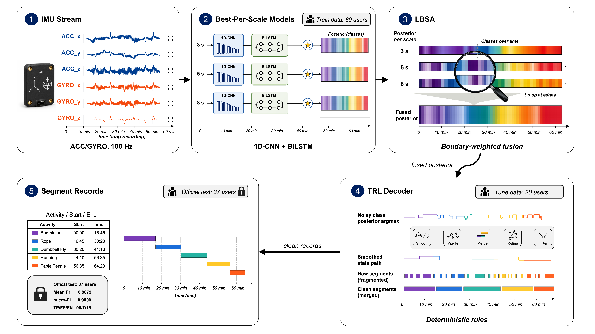
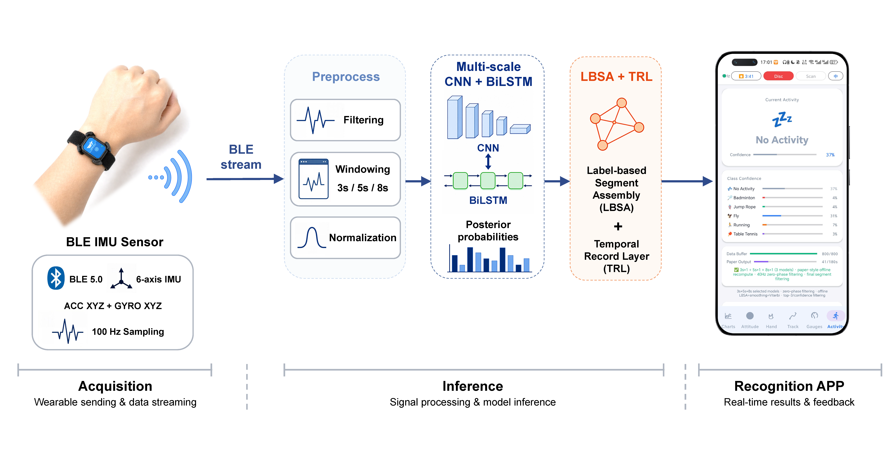

<p align="center">
  <strong>English</strong> · <a href="README_zh.md">中文</a>
</p>

<h1 align="center">Wearable IMU Activity Segmentation Pipeline</h1>

<p align="center">
  <strong>Long-session activity segmentation from wearable accelerometer and gyroscope streams</strong><br>
  A reproducible Python research pipeline with multi-scale temporal post-processing and an Android on-device ONNX demo.
</p>

<p align="center">
  <a href="https://www.python.org/"></a>
  <a href="https://pytorch.org/"></a>
  <a href="android_realtime_app/"></a>
  <a href="#quick-start"></a>
  <a href="LICENSE"></a>
</p>

<p align="center">
  <a href="#overview">Overview</a> ·
  <a href="#pipeline">Pipeline</a> ·
  <a href="#quick-start">Quick Start</a> ·
  <a href="#data">Data</a> ·
  <a href="#model-assets">Models</a> ·
  <a href="#android-app">Android</a> ·
  <a href="#reproduction">Reproduction</a> ·
  <a href="#license">License</a>
</p>

> [!IMPORTANT]
> The GitHub repository does not distribute participant sensor recordings. Repository-authored source code and the distributed Python/Android model assets are Apache-2.0; datasets and third-party dependencies retain their own terms.

<a id="overview"></a>
## Overview

This project segments long wearable IMU sessions into activity records:

```text
user_id, category, start, end
```

The Python pipeline reads accelerometer and gyroscope streams, trains multi-scale neural classifiers, aligns 3s/5s/8s predictions, applies temporal decoding and boundary refinement, and writes segment-level prediction workbooks. The repository also includes an Android app for WT9011DCL-BT50 BLE acquisition, visualization, CSV recording, and on-device ONNX inference.

| Goal | Implemented approach | Public boundary |
| --- | --- | --- |
| Segment long-session wearable motion streams | Multi-kernel 1D-CNN + BiLSTM window classifiers | Requires authorized local sensor files for full inference/training |
| Improve temporal consistency | Multi-scale probability alignment, LBSA fusion, smoothing, Viterbi decoding, boundary refinement, overlap resolution, confidence filtering, and Top-K pruning | Smoke test uses temporary files only |
| Support deployable demonstration | Android BLE acquisition and ONNX Runtime inference | Bundled demo assets are documented separately from private datasets |
| Keep experiments reproducible | Evaluation, robustness, visualization, and public-dataset portability scripts | Generated outputs remain local under ignored directories |

Supported foreground activities are `羽毛球`, `跳绳`, `飞鸟`, `跑步`, and `乒乓球`. Background/no-activity is modeled internally where needed, but submitted segment records contain foreground activities.

<a id="pipeline"></a>
## Pipeline

<p align="center">
  <a href="experiments/figures/fig02_overall_framework.png">
    
  </a>
</p>
<p align="center"><em>Figure 1 | Overall activity-segmentation framework from raw IMU streams to segment records.</em></p>

Key components:

- Unified local data layout under `data/` for signals, annotations, splits, metadata, and optional public external datasets.
- Source package under `src/imu_activity_pipeline/`, with root scripts kept as compatibility entry points.
- Training entry points for sequential, parallel, and single-model workflows.
- Segment-level evaluation with same-class one-to-one IoU matching.
- Experiment scripts for internal evaluation, post-processing policy checks, public portability checks, and figure generation.
- Android demo with BLE ingestion, live views, offline recognition, and on-device multi-scale inference.

<a id="quick-start"></a>
## Quick Start

```bash
git clone https://github.com/rudykon/Wearable-IMU-Activity-Segmentation-Pipeline.git
cd Wearable-IMU-Activity-Segmentation-Pipeline

conda env create -f environment.yml
conda activate imu-activity-pipeline
python -m pip install -e .
python tests/smoke_test.py
```

The smoke test checks imports, canonical paths, tiny temporary signal loading, annotation loading, and workbook writing. It does not require private raw data or trained checkpoints.

For a pip-only environment, install the pinned Python dependencies first:

```bash
python -m pip install -r requirements.txt
python -m pip install -e .
```

After placing authorized data under `data/` and model assets under `saved_models/`, run inference:

```bash
python run_inference.py
```

The default split is `external_test`, and the default output is:

```text
predictions_external_test.xlsx
```

Useful root commands:

```bash
python train.py
python train_parallel.py
python evaluate.py --split external_test
python -m imu_activity_pipeline.inference \
  --data_dir data/signals/internal_eval \
  --output predictions_internal_eval.xlsx
```

See [docs/USAGE.md](docs/USAGE.md) for training, evaluation, Python interfaces, packaged executable layout, and experiment scripts.

<a id="data"></a>
## Data

The dataset is not distributed directly in this GitHub repository. This repository keeps the expected local layout and data-use instructions so authorized users can place files consistently.

| Component | Default local path | Notes |
| --- | --- | --- |
| Signal streams | `data/signals/{train,internal_eval,external_test}/` | UTF-8 tab-separated `.txt` files |
| Annotations | `data/annotations/*_annotations.csv` | `split,user_id,category,start,end` |
| Split metadata | `data/splits/`, `data/metadata/` | User lists, manifests, label summaries, dataset metadata |
| Optional public datasets | `data/public_external/` | User-downloaded assets; each dataset keeps its own license |

Until the PhysioNet repository is formally released, research-use access is requested through the Tencent Questionnaire link maintained in [data/README.md](data/README.md). After PhysioNet release, follow the PhysioNet link and citation information maintained in the repository documentation.

<a id="model-assets"></a>
## Model Assets

The Python research pipeline is code-first. Selected reproducibility checkpoints, normalization parameters, and ensemble configuration files are tracked under `saved_models/`; additional local training outputs are ignored by Git.

Default multi-scale inference expects:

```text
saved_models/ensemble_config.json
saved_models/combined_model_3s_seed42.pth
saved_models/combined_model_5s_seed123.pth
saved_models/combined_model_8s_seed123.pth
saved_models/norm_params_3s.pkl
saved_models/norm_params_5s.pkl
saved_models/norm_params_8s.pkl
```

Asset documentation:

- [docs/ASSETS.md](docs/ASSETS.md) describes local data, checkpoint, and generated-output boundaries.
- [saved_models/WEIGHTS_LICENSE](saved_models/WEIGHTS_LICENSE) covers the distributed Python model assets.
- [android_realtime_app/MODEL_CARD.md](android_realtime_app/MODEL_CARD.md) documents Android ONNX assets, checksums, intended use, and limitations.
- [android_realtime_app/WEIGHTS_LICENSE](android_realtime_app/WEIGHTS_LICENSE) covers the distributed Android model assets.

<a id="android-app"></a>
## Android App

The Android demo in [android_realtime_app/](android_realtime_app/) supports WT9011DCL-BT50 BLE scan/connect, live acceleration and angular-velocity charts, attitude/compass/trajectory views, CSV recording, offline-file recognition, and on-device 3s/5s/8s ONNX inference.

<p align="center">
  <a href="experiments/figures/fig03_physical_deployment_chain.png">
    
  </a>
</p>
<p align="center"><em>Figure 2 | Physical deployment chain from wearable IMU acquisition to Android-side recognition.</em></p>

Build with Android Studio, or from a JDK 17 + Android SDK environment:

```bash
cd android_realtime_app
./gradlew assembleDebug
```

For BLE integration notes and desktop debugging tools, see [android_realtime_app/docs/README.md](android_realtime_app/docs/README.md) and [android_realtime_app/tools/desktop/README.md](android_realtime_app/tools/desktop/README.md).

<a id="reproduction"></a>
## Reproduction

The top-level experiment wrapper is:

```bash
bash run_reproducibility_experiments.sh
```

It runs saved-model evaluation, internal robustness checks, policy-selection checks, PPG signal-quality analysis, representative timeline figures, external unlabeled cohort stress tests, and summary figure generation. It requires the local data and checkpoint assets described in [docs/ASSETS.md](docs/ASSETS.md).

Outputs are written under:

```text
experiments/results/
experiments/figures/
experiments/logs/
```

Use a specific interpreter with:

```bash
PYTHON_BIN=/path/to/python bash run_reproducibility_experiments.sh
```

<a id="repository-map"></a>
## Repository Map

| Path | Purpose |
| --- | --- |
| `src/imu_activity_pipeline/` | Core Python package for configuration, loading, training, inference, post-processing, and evaluation |
| `run_inference.py`, `train.py`, `train_parallel.py`, `evaluate.py` | Source-checkout compatibility entry points |
| `saved_models/` | Tracked reproducibility assets plus ignored local training outputs |
| `data/` | Local data layout placeholders and access instructions |
| `experiments/` | Evaluation, robustness, visualization, and public-dataset portability scripts |
| `scripts/` | Auxiliary analysis, tuning, and figure helpers |
| `android_realtime_app/` | Android BLE acquisition, visualization, recording, and ONNX inference app |
| `docs/` | Usage and asset-boundary documentation |
| `tests/` | Lightweight public smoke checks |

<a id="license"></a>
## License

Repository-authored source code and the distributed Python and Android model assets are licensed under the [Apache License 2.0](LICENSE). Scope-specific copies are kept at [saved_models/WEIGHTS_LICENSE](saved_models/WEIGHTS_LICENSE), [android_realtime_app/LICENSE](android_realtime_app/LICENSE), and [android_realtime_app/WEIGHTS_LICENSE](android_realtime_app/WEIGHTS_LICENSE). Datasets and third-party dependencies retain their own terms.
