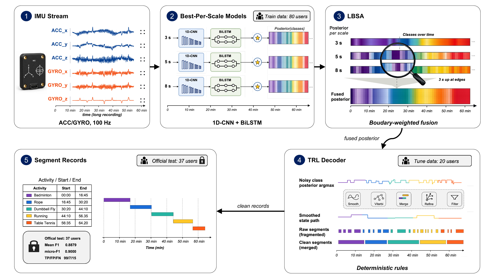
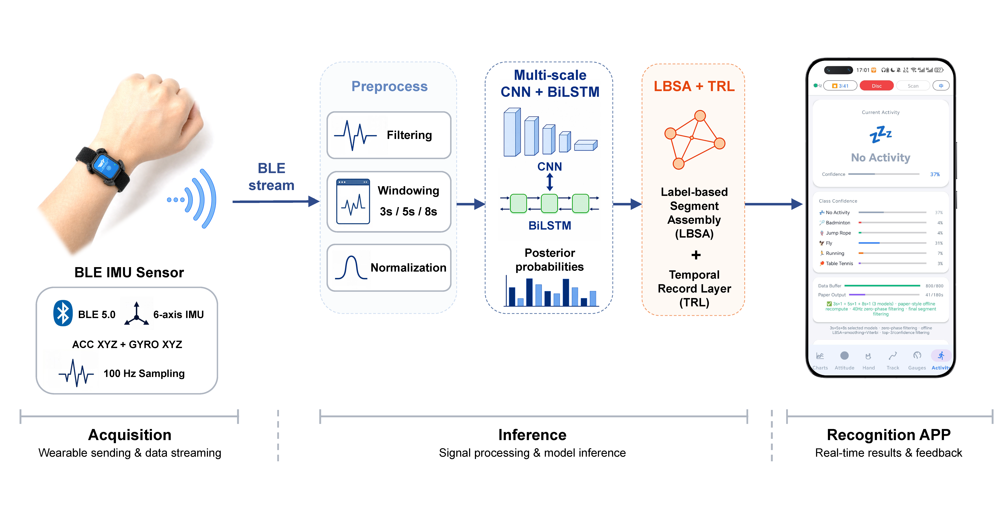

# 可穿戴 IMU 活动分割流程

English version: [README.md](README.md)

本仓库提供一套面向可穿戴 IMU 信号的活动分割与识别流程，覆盖数据读取、滑窗特征构建、模型训练、片段级后处理、评估和实验复现。代码已整理为 `src/` 包结构，便于在本地开发、复现实验或作为研究基线扩展。

仓库同时包含移动端演示程序 `android_realtime_app/`，用于 WT9011DCL-BT50 蓝牙 IMU 的实时采集、可视化和端侧 ONNX 推理。

## 流程图




## 主要特点

- 统一的数据入口：获得数据授权后，默认从 `data/` 下读取数据清单、标注表和 IMU 信号文件。
- 模块化流水线：核心逻辑位于 `src/imu_activity_pipeline/`，根目录脚本仅作为兼容入口。
- 可复现实验：`experiments/` 中保留分析与绘图脚本，结果默认输出到 `experiments/results/` 和 `experiments/figures/`。
- 移动端演示：`android_realtime_app/` 提供 Android BLE 采集、CSV 录制和端侧识别流程。
- 开源友好：大型数据和模型文件不直接纳入版本管理，仓库中保留目录说明和下载/放置约定。

## 目录结构

```text
.
├── src/imu_activity_pipeline/   # 核心 Python 包
│   ├── config.py                # 路径、标签、特征和训练配置
│   ├── sensor_data_processing.py            # 信号读取、过滤、滑窗、标签和增强
│   ├── neural_network_models.py             # 神经网络结构与辅助损失
│   ├── inference.py             # 推理与片段后处理
│   ├── train*.py                # 训练实现
│   └── input.py / output.py     # 轻量输入输出接口
├── run_inference.py                      # 端到端流水线兼容入口
├── train.py                     # 单进程训练入口
├── train_parallel.py            # 并行训练入口
├── train_single_model.py                 # 单个目标/配置训练入口
├── evaluate.py                  # 评估入口
├── experiments/                 # 实验、分析和绘图脚本
├── scripts/                     # 辅助工具脚本
├── tests/                       # 轻量健康检查
├── android_realtime_app/        # Android 实时采集与端侧 ONNX 推理 App
├── data/                        # 数据目录，实际大文件由数据发布渠道提供
├── saved_models/                # 模型输出目录，权重不纳入版本管理
└── docs/                        # 使用说明与资产说明
```

当前数据目录约定如下：

```text
data/
├── annotations/                 # 训练/评估标注表
├── metadata/                    # 数据划分与信号清单
├── splits/                      # 划分配置或派生清单
├── public_external/             # 公共外部数据适配材料
├── signals/
│   ├── train/
│   ├── internal_eval/
│   └── external_test/
└── README.md / README_zh.md
```

## 环境要求与安装

推荐使用 Python 3.12 和仓库提供的 Conda 环境文件。训练建议使用支持 CUDA 的 GPU；推理也可以在 CPU 上运行。

```bash
conda env create -f environment.yml
conda activate imu-activity-pipeline
python -m pip install -e .
```

安装完成后运行：

```bash
python tests/smoke_test.py
```

如果只想临时运行，也可以在仓库根目录直接执行这些入口脚本；它们会优先使用本地源码包。

## 快速开始

请先按 [数据获取](#数据获取) 说明申请或下载数据，并将授权数据放入 `data/` 对应目录。

运行端到端流程：

```bash
python run_inference.py
```

默认针对 `external_test` 划分生成 `predictions_external_test.xlsx`。

训练模型：

```bash
python train.py
```

并行训练：

```bash
python train_parallel.py
```

评估预测结果：

```bash
python evaluate.py --help
```

运行轻量健康检查：

```bash
python tests/smoke_test.py
```

## Android App

移动端演示程序位于 [android_realtime_app/](android_realtime_app/)，支持 WT9011DCL-BT50 BLE 采集、可视化、CSV 录制和端侧 ONNX 推理。本项目还提供了安卓版本的演示app供下载。



可用 Android Studio 打开该目录，或在 JDK 17 + Android SDK 环境下构建：

```bash
cd android_realtime_app
./gradlew assembleDebug
```

## 数据获取

本 GitHub 仓库不直接分发数据集。数据集访问说明维护在本项目 GitHub 页面。

在 PhysioNet 仓库正式发布前，研究用途数据申请通过本页面的问卷链接（https://wj.qq.com/s2/26600660/1b91）提交。申请由负责数据管理的海南大学生物学与工程学院负责审核；审核通过后，读者按反馈说明下载数据，并根据 [data/README_zh.md](data/README_zh.md) 放入 `data/` 目录。

待 PhysioNet 仓库正式发布后，GitHub 页面问卷链接会失效，读者改为直接通过 PhysioNet 获取数据。本项目 GitHub 页面会维护最新的 PhysioNet 数据链接和引用信息。

## 数据和模型资产

Python 研究流程的大体量数据和模型权重不直接提交到 GitHub。当前 `data/` 目录只保留目录结构和数据获取说明；获得授权的数据文件由 `.gitignore` 保持为本地文件。模型权重可放置到 `saved_models/` 或在运行时通过参数指定。Android App 随仓库发布小体量 ONNX 演示权重，说明见 [android_realtime_app/MODEL_CARD.md](android_realtime_app/MODEL_CARD.md)，权重许可证见 [android_realtime_app/WEIGHTS_LICENSE](android_realtime_app/WEIGHTS_LICENSE)。

更多资产说明见 [docs/ASSETS.md](docs/ASSETS.md)，使用说明见 [docs/USAGE.md](docs/USAGE.md)。

## 实验复现

一键运行主要实验与绘图流程：

```bash
bash run_reproducibility_experiments.sh
```

默认输出：

- 表格和中间结果：`experiments/results/`
- 图像：`experiments/figures/`
- 日志：`experiments/logs/`

如需使用指定解释器，可设置 `PYTHON_BIN`：

```bash
PYTHON_BIN=/path/to/python bash run_reproducibility_experiments.sh
```

## Shell 脚本保留原则

当前保留的根目录 `.sh` 只作为公开、通用入口：

- `run_reproducibility_experiments.sh`：复现实验和图表生成。
- `run_training.sh`：训练启动入口，会在可用时使用 tmux。
- `run_training_in_tmux.sh`：`run_training.sh` 的 tmux 执行后端。

一次性、本地化或只服务个人排队运行的脚本不再作为公开入口保留，避免根目录变成运行记录集合。

## 许可证

请根据数据、模型权重和依赖库的授权情况补充仓库许可证与引用方式。
