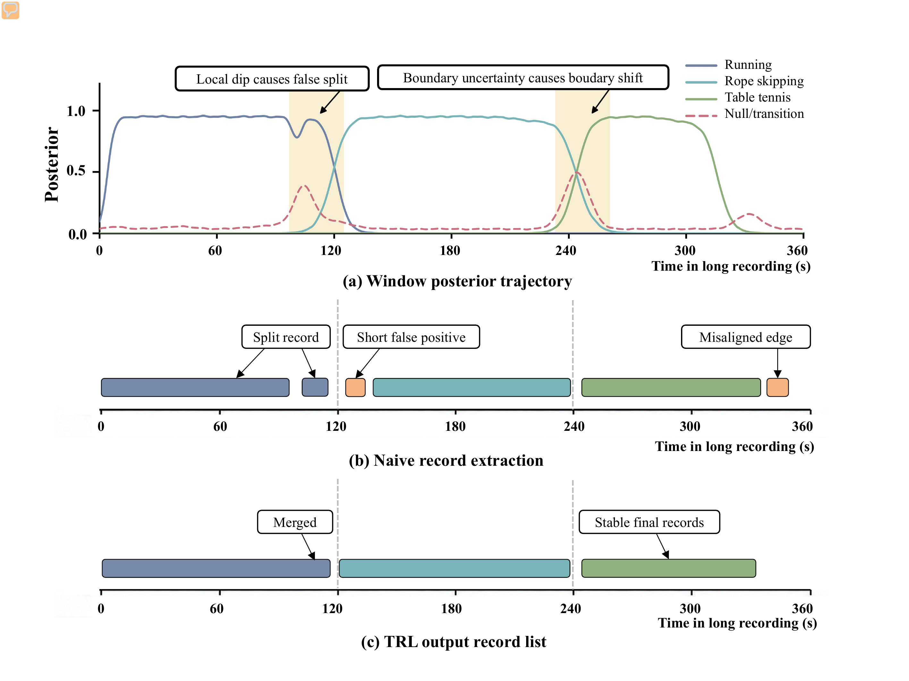

---
hide:
  - toc
---

<section class="home-hero">
  
  
  

    Wearable IMU
    <h1>Motion to activity records.</h1>
    
Segment 100 Hz wrist IMU data into timestamped activities.

    

      <a class="hero-button primary" href="context/use-cases/">
        Scenarios
        <svg viewBox="0 0 24 24" aria-hidden="true"><path d="M5 12h14M13 6l6 6-6 6" fill="none" stroke="currentColor" stroke-width="2" stroke-linecap="round" stroke-linejoin="round"/></svg>
      </a>
      <a class="hero-button" href="https://huggingface.co/spaces/config-h/Wearable-IMU-Activity-Segmentation-Pipeline" target="_blank" rel="noopener">
        Demo
        <svg viewBox="0 0 24 24" aria-hidden="true"><path d="M5 12h14M13 6l6 6-6 6" fill="none" stroke="currentColor" stroke-width="2" stroke-linecap="round" stroke-linejoin="round"/></svg>
      </a>
      <a class="hero-button" href="https://huggingface.co/config-h/Wearable-IMU-Activity-Segmentation-Pipeline" target="_blank" rel="noopener">Models</a>
      <a class="hero-button" href="research/paper/">Results</a>
    

    

      Long sessions
      5 activities
      Web + Android
    

  

  

    
3 scales

    
Stable records

    

      

        LIVE IMU
        100 HZ
      

      

        <svg viewBox="0 0 520 224" role="img" aria-label="Stylized accelerometer and gyroscope traces decoded into activity segments">
          <g stroke="#c7d2fe" stroke-width="1" opacity=".65">
            <path d="M0 42H520M0 84H520M0 126H520M0 168H520"/>
            <path d="M65 0V180M130 0V180M195 0V180M260 0V180M325 0V180M390 0V180M455 0V180"/>
          </g>
          <path d="M0 96C20 91 28 58 44 83S70 132 86 99s24-66 44-20 34 31 49-6 26-65 43 9 35 14 47-17 25-18 41 21 32 33 48-22 29-55 43 4 31 62 47 3 30-53 44-6 27 20 38-2 20-17 30 3" fill="none" stroke="#4f46e5" stroke-width="4" stroke-linecap="round"/>
          <path d="M0 130C24 112 33 154 53 129s33-74 49-15 31 45 47 5 29-38 44 17 33 19 47-14 27-57 45 7 34 19 49-18 30-27 45 16 28 36 45-8 27-30 42 2 28 26 44-4" fill="none" stroke="#7c3aed" stroke-width="3" stroke-linecap="round" opacity=".9"/>
          <g>
            <rect x="5" y="192" width="78" height="13" rx="6.5" fill="#10b981"/>
            <rect x="89" y="192" width="116" height="13" rx="6.5" fill="#f59e0b"/>
            <rect x="211" y="192" width="55" height="13" rx="6.5" fill="#6366f1"/>
            <rect x="272" y="192" width="98" height="13" rx="6.5" fill="#8b5cf6"/>
            <rect x="376" y="192" width="139" height="13" rx="6.5" fill="#14b8a6"/>
          </g>
        </svg>
      

      

        6 CHANNELS
        TIMELINE
      

      

        
<strong>3 / 5 / 8 s</strong>windows

        
<strong>3 models</strong>combined

        
<strong>1 timeline</strong>output

      

    

  

</section>

Problem

## Signals are not records. {: .section-title}

One hour contains 2.16 million readings. The useful output is a short activity log.

  <article class="story-card story-card-input">
    Input
    <strong>Six motion channels</strong>
    

      ACC_XACC_YACC_Z
      GYRO_XGYRO_YGYRO_Z
    

    
Movement, transitions, pauses, and noise share one stream.

  </article>
  <article class="story-card story-card-output">
    Output
    <strong>Timestamped activities</strong>
    

      
<time>09:02–09:17</time>Badminton

      
<time>09:25–09:34</time>Jump rope

      
<time>09:41–09:53</time>Running

    

    
Each record gives the activity, start, end, and duration.

  </article>

Illustrative times; no participant data.

  
<strong>100 Hz</strong>sampling

  
<strong>6</strong>channels

  
<strong>5</strong>activities

  
<strong>4</strong>output fields

Scenarios

## Where it fits {: .section-title}

  <article class="scenario-card">
    Research
    <h3>Long-session benchmarks</h3>
    
Compare records, boundaries, counts, and false alarms.

  </article>
  <article class="scenario-card">
    Prototype
    <h3>Workout logs</h3>
    
Create reviewable records for the five supported activities.

  </article>
  <article class="scenario-card">
    Mobile
    <h3>Phone deployment</h3>
    
Run the sensor-to-Android ONNX path over BLE.

  </article>
  <article class="scenario-card">
    Review
    <h3>Annotation aid</h3>
    
Locate likely activities and boundary errors for human review.

  </article>

  
New devices, placements, and populations need new validation.

  <a class="md-button md-button--primary" href="context/use-cases/">All scenarios</a>

Challenge

## Good windows can make bad records. {: .section-title}

Confidence dips can split events, shift boundaries, or create false alarms.

<figure class="paper-figure">
  
  <figcaption class="pipeline-caption">Paper Fig. 1. Timeline decoding joins unstable window predictions.</figcaption>
</figure>

  
<strong>137</strong>recordings

  
<strong>259.6 h</strong>sensor data

  
<strong>0.89</strong>mean-user F1

  
<strong>0.90</strong>micro-F1

  
These F1 scores measure complete records on the fixed external test.

  <a class="md-button md-button--primary" href="research/paper/">Full results</a>

Method

## Four steps {: .section-title}

  <article class="feature-card process-card">
    01
    <h3>Capture</h3>
    
Keep six IMU channels and timestamps.

  </article>
  <article class="feature-card process-card">
    02
    <h3>Classify</h3>
    
Run 3-, 5-, and 8-second models.

  </article>
  <article class="feature-card process-card">
    03
    <h3>Decode</h3>
    
LBSA selects scale; TRL builds stable records.

  </article>
  <article class="feature-card process-card">
    04
    <h3>Use</h3>
    
Export records, inspect plots, or run on Android.

  </article>

<figure class="pipeline-frame">
  
  <figcaption class="pipeline-caption">IMU → three models → LBSA → TRL → records.</figcaption>
</figure>

Evidence

## Results and limits {: .section-title}

  <article class="evidence-card">
    Supported
    <h3>Tested here</h3>
    <ul>
      <li>Five activities in long sessions.</li>
      <li>Fixed external test: 37 recordings.</li>
      <li>Python, web demo, and Android paths.</li>
    </ul>
  </article>
  <article class="evidence-card caution">
    Not established
    <h3>Test again</h3>
    <ul>
      <li>New devices, placements, users, or activities.</li>
      <li>Clinical, coaching, safety, or production use.</li>
      <li>Dense or adjacent same-class events.</li>
    </ul>
  </article>

Next

## Choose a path {: .section-title}

  <a class="route-card" href="https://huggingface.co/spaces/config-h/Wearable-IMU-Activity-Segmentation-Pipeline" target="_blank" rel="noopener">
    2 min
    <h3>Demo</h3>
    
Run a synthetic session in the browser.

  </a>
  <a class="route-card" href="context/use-cases/">
    Context
    <h3>Scenarios</h3>
    
See uses, assumptions, and limits.

  </a>
  <a class="route-card" href="guide/pipeline/">
    Technical
    <h3>Pipeline</h3>
    
Trace input, models, decoding, and output.

  </a>
  <a class="route-card" href="deployment/android/">
    Mobile
    <h3>Android</h3>
    
Build the BLE and ONNX app.

  </a>

