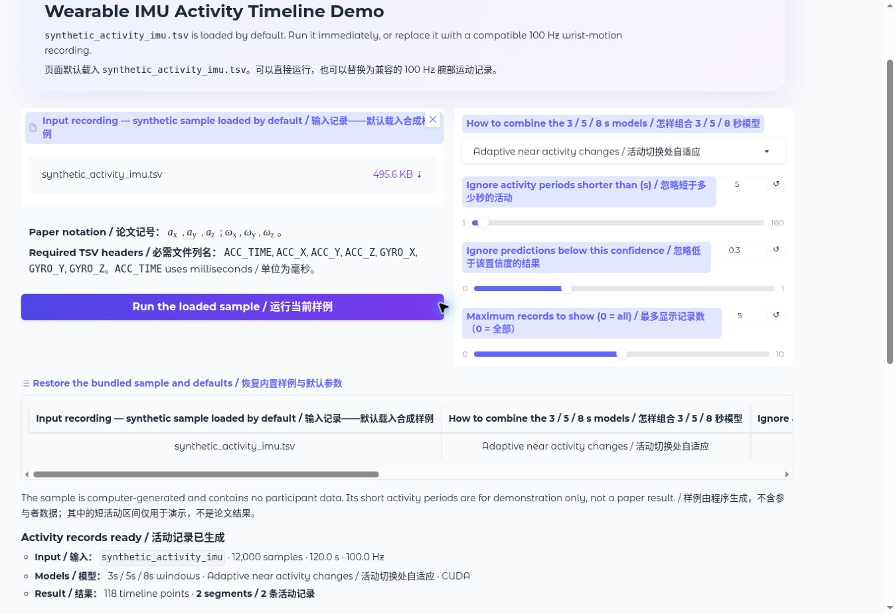

---
hide:
  - navigation
  - toc
---

<section class="home-hero showcase-hero">
  

    
Wearable IMU activity records

    <h1 class="paper-title">An End-to-End Wearable IMU System for Segment-Level Activity Recognition via Multi-Scale Arbitration and a Temporal Record Layer</h1>
    
A multi-scale wrist-IMU pipeline that converts continuous 100 Hz signals into timestamped activity records.

    

      <a class="hero-button primary" href="deployment/android/">
        Android Demo
        <svg viewBox="0 0 24 24" aria-hidden="true"><path d="M5 12h14M13 6l6 6-6 6" fill="none" stroke="currentColor" stroke-width="2" stroke-linecap="round" stroke-linejoin="round"/></svg>
      </a>
      <a class="hero-button" href="https://huggingface.co/spaces/config-h/Wearable-IMU-Activity-Segmentation-Pipeline" target="_blank" rel="noopener">HF Demo</a>
      <a class="hero-button" href="guide/pipeline/">Method</a>
      <a class="hero-button github-button" href="https://github.com/rudykon/Wearable-IMU-Activity-Segmentation-Pipeline" target="_blank" rel="noopener">
        <svg viewBox="0 0 24 24" aria-hidden="true"><path fill="currentColor" d="M12 .7a11.5 11.5 0 0 0-3.64 22.41c.58.11.79-.25.79-.56v-2.22c-3.23.7-3.91-1.37-3.91-1.37-.53-1.34-1.29-1.7-1.29-1.7-1.05-.72.08-.71.08-.71 1.17.08 1.78 1.2 1.78 1.2 1.04 1.78 2.72 1.27 3.39.97.1-.75.4-1.27.74-1.56-2.58-.29-5.29-1.29-5.29-5.68 0-1.26.45-2.28 1.19-3.09-.12-.29-.52-1.48.11-3.05 0 0 .97-.31 3.16 1.18a10.9 10.9 0 0 1 5.76 0c2.19-1.49 3.16-1.18 3.16-1.18.63 1.57.23 2.76.11 3.05.74.81 1.19 1.83 1.19 3.09 0 4.4-2.72 5.38-5.31 5.67.42.36.79 1.07.79 2.16v3.2c0 .31.21.68.8.56A11.5 11.5 0 0 0 12 .7Z"/></svg>
        GitHub
      </a>
    

    

      259.6 h sensor data
      37 external-test recordings
      0.90 micro-F1
    

  

  

    

      

        Live IMU stream
        100 Hz · 6 channels
      

      <svg class="hero-wave" viewBox="0 0 520 210" role="img" aria-label="Stylized accelerometer and gyroscope traces decoded into activity segments">
        <g stroke="#dce6f1" stroke-width="1">
          <path d="M0 40H520M0 80H520M0 120H520M0 160H520"/>
          <path d="M65 0V170M130 0V170M195 0V170M260 0V170M325 0V170M390 0V170M455 0V170"/>
        </g>
        <path d="M0 92C18 84 28 50 45 78s27 51 44 17 25-63 44-18 33 32 49-5 27-62 45 8 34 16 48-16 27-20 44 17 31 35 48-20 30-50 44 5 30 55 47 2 28-49 45-5 28 18 38-2 22-14 30 2" fill="none" stroke="#3d6fb6" stroke-width="4" stroke-linecap="round"/>
        <path d="M0 128C24 112 34 151 55 126s31-68 49-13 31 42 47 5 29-35 45 15 32 18 47-13 27-53 45 7 34 18 49-17 30-25 45 15 29 33 46-8 27-28 43 2 28 23 44-4" fill="none" stroke="#756bb1" stroke-width="3" stroke-linecap="round" opacity=".9"/>
        <g>
          <rect x="8" y="184" width="96" height="12" rx="6" fill="#168c7e"/>
          <rect x="111" y="184" width="126" height="12" rx="6" fill="#d9822b"/>
          <rect x="244" y="184" width="72" height="12" rx="6" fill="#3d6fb6"/>
          <rect x="323" y="184" width="86" height="12" rx="6" fill="#756bb1"/>
          <rect x="416" y="184" width="96" height="12" rx="6" fill="#168c7e"/>
        </g>
      </svg>
      

        3 s model
        5 s model
        8 s model
        <strong>LBSA</strong>
        <strong>TRL</strong>
      

      

        
<time>09:02–09:17</time><strong>Badminton</strong>

        
<time>09:25–09:34</time><strong>Jump rope</strong>

        
<time>09:41–09:53</time><strong>Running</strong>

      

      

        Continuous signal
        Stable records
      

    

  

</section>

<section class="home-section" markdown="1">

## Problem and output

Window-level predictions do not directly provide reliable activity records. A long-session system must recover the activity class, event count, duration, and boundaries from continuous sensor streams.

  <code>6-channel wrist IMU stream</code>
  →
  <code>{activity, start, end}</code>

The evaluated task covers five sports recorded from a 100 Hz wrist accelerometer and gyroscope. Background motion supports decoding but is not emitted as a workout record.

</section>

<section class="home-section" markdown="1">

## Method

<figure class="pipeline-frame">
  
  <figcaption class="pipeline-caption">IMU stream → 3/5/8-second posteriors → LBSA → TRL → activity records.</figcaption>
</figure>

  <article class="method-point">
    01
    <h3>Multi-scale models</h3>
    
Scale-specific CNN–BiLSTMs analyze 3-, 5-, and 8-second views.

  </article>
  <article class="method-point">
    02
    <h3>Boundary-aware fusion</h3>
    
LBSA favors short evidence near transitions and longer context in stable regions.

  </article>
  <article class="method-point">
    03
    <h3>Record construction</h3>
    
TRL smooths, decodes, merges, refines, and filters the fused timeline.

  </article>

[Read the full method](guide/pipeline.md){ .md-button }

</section>

<section class="home-section" markdown="1">

## Evidence

The operating point was frozen before evaluation on the independent 37-recording external test.

  
<strong>259.6 h</strong>sensor data

  
<strong>37 / 114</strong>test recordings / segments

  
<strong>0.90</strong>micro-F1

  

    <strong>0.89</strong>
    mean-user F1 · LBSA + TRL
  

  

    <h3>Evaluated scope</h3>
    
Five activities under the studied device, wrist placement, and long-session protocol.

    
<strong>New devices, placements, users, activities, and deployment conditions require new validation.</strong>

  

[Inspect results and failure cases](research/paper.md){ .md-button }

</section>

<section class="home-section" markdown="1">

## See the pipeline run

  <a class="demo-showcase__media" href="https://huggingface.co/spaces/config-h/Wearable-IMU-Activity-Segmentation-Pipeline" target="_blank" rel="noopener" aria-label="Open the live Hugging Face demo">
    
    Open live demo ↗
  </a>
  

    
Browser demo

    <h3>Signals, probabilities, timeline, and records in one view</h3>
    
Run the public 3-, 5-, and 8-second models with the bundled synthetic recording or a compatible wrist-IMU file.

    <ul>
      <li>Six-channel signal plots</li>
      <li>Decoded activity timeline</li>
      <li>Record table and CSV export</li>
    </ul>
    

      <a class="demo-action primary" href="https://huggingface.co/spaces/config-h/Wearable-IMU-Activity-Segmentation-Pipeline" target="_blank" rel="noopener">Run live demo</a>
      <a class="demo-action github" href="https://github.com/rudykon/Wearable-IMU-Activity-Segmentation-Pipeline/tree/main/demo" target="_blank" rel="noopener">
        <svg viewBox="0 0 24 24" aria-hidden="true"><path fill="currentColor" d="M12 .7a11.5 11.5 0 0 0-3.64 22.41c.58.11.79-.25.79-.56v-2.22c-3.23.7-3.91-1.37-3.91-1.37-.53-1.34-1.29-1.7-1.29-1.7-1.05-.72.08-.71.08-.71 1.17.08 1.78 1.2 1.78 1.2 1.04 1.78 2.72 1.27 3.39.97.1-.75.4-1.27.74-1.56-2.58-.29-5.29-1.29-5.29-5.68 0-1.26.45-2.28 1.19-3.09-.12-.29-.52-1.48.11-3.05 0 0 .97-.31 3.16 1.18a10.9 10.9 0 0 1 5.76 0c2.19-1.49 3.16-1.18 3.16-1.18.63 1.57.23 2.76.11 3.05.74.81 1.19 1.83 1.19 3.09 0 4.4-2.72 5.38-5.31 5.67.42.36.79 1.07.79 2.16v3.2c0 .31.21.68.8.56A11.5 11.5 0 0 0 12 .7Z"/></svg>
        Demo source
      </a>
      <a class="demo-action" href="deployment/hugging-face/">Input and privacy notes</a>
    

  

</section>

<section class="home-section" markdown="1">

## Reproduce and inspect

  <a class="resource-card" href="https://github.com/rudykon/Wearable-IMU-Activity-Segmentation-Pipeline" target="_blank" rel="noopener">
    Source
    <h3>GitHub</h3>
    
Browse the package, experiments, Android app, issues, and release history.

  </a>
  <a class="resource-card" href="https://huggingface.co/config-h/Wearable-IMU-Activity-Segmentation-Pipeline" target="_blank" rel="noopener">
    Weights
    <h3>Models</h3>
    
Download verified PyTorch and ONNX assets from Hugging Face.

  </a>
  <a class="resource-card" href="getting-started/quickstart/">
    Code
    <h3>Quickstart</h3>
    
Verify the public package and run authorized-data inference.

  </a>
  <a class="resource-card" href="deployment/android/">
    On-device demo
    <h3>Android APK</h3>
    
Download the app and a synthetic sample for offline on-device inference.

  </a>

Participant recordings are not distributed on GitHub. The [reproduction guide](reproduce.md) separates public verification from workflows that require authorized data.

</section>
