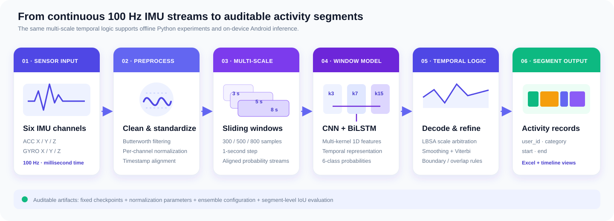

---
hide:
  - toc
---

<section class="home-hero">
  

    Open-source wearable AI
    <h1>Turn long IMU streams into activity timelines.</h1>
    

      A reproducible Python and Android pipeline for multi-scale segmentation of
      wrist-worn accelerometer and gyroscope data—covering training, inference,
      temporal decoding, segment evaluation, and on-device deployment.
    

    

      <a class="hero-button primary" href="getting-started/quickstart/">Run the pipeline →</a>
      <a class="hero-button" href="guide/pipeline/">Explore the architecture</a>
      <a class="hero-button" href="https://github.com/rudykon/Wearable-IMU-Activity-Segmentation-Pipeline">View on GitHub</a>
    

  

  

    

      

        LIVE SENSOR STREAM
        100 Hz
      

      <svg viewBox="0 0 520 220" role="img" aria-label="Stylized accelerometer and gyroscope signal traces">
        <g stroke="rgba(255,255,255,.09)" stroke-width="1">
          <path d="M0 44H520M0 88H520M0 132H520M0 176H520"/>
          <path d="M65 0V220M130 0V220M195 0V220M260 0V220M325 0V220M390 0V220M455 0V220"/>
        </g>
        <path d="M0 110C20 106 28 72 44 96S70 145 86 113s24-67 44-21 34 31 49-5 26-66 43 9 35 13 47-18 25-18 41 21 32 34 48-21 29-56 43 3 31 63 47 4 30-54 44-6 27 20 38-3 20-17 30 3" fill="none" stroke="#6ee7e4" stroke-width="4" stroke-linecap="round"/>
        <path d="M0 142C24 124 33 166 53 141s33-74 49-15 31 45 47 5 29-38 44 17 33 19 47-14 27-57 45 7 34 19 49-18 30-27 45 16 28 36 45-8 27-30 42 2 28 26 44-4" fill="none" stroke="#f6b94b" stroke-width="3" stroke-linecap="round" opacity=".92"/>
        <g>
          <rect x="18" y="188" width="74" height="10" rx="5" fill="#58a973"/>
          <rect x="98" y="188" width="118" height="10" rx="5" fill="#f0b44b"/>
          <rect x="222" y="188" width="51" height="10" rx="5" fill="#5f87bf"/>
          <rect x="279" y="188" width="96" height="10" rx="5" fill="#9a72bb"/>
          <rect x="381" y="188" width="121" height="10" rx="5" fill="#4eb8b3"/>
        </g>
      </svg>
      

        ACC + GYRO
        3 s · 5 s · 8 s → segments
      

    

  

</section>

  
<strong>100 Hz</strong>sampling rate

  
<strong>6</strong>physical IMU channels

  
<strong>3</strong>temporal scales

  
<strong>5 + bg</strong>output classes

## One repository, the complete research-to-device path

  <article class="feature-card">
    ⌁
    <h3>Long-session segmentation</h3>
    
Convert continuous per-user sensor recordings into explicit <code>user_id, category, start, end</code> activity records.

  </article>
  <article class="feature-card">
    ⋈
    <h3>Multi-scale modeling</h3>
    
Align 3-, 5-, and 8-second CNN–BiLSTM predictions so short motion signatures and longer context inform one timeline.

  </article>
  <article class="feature-card">
    ↝
    <h3>Temporal decoding</h3>
    
Apply LBSA fusion, probability smoothing, Viterbi decoding, boundary refinement, overlap handling, and segment filtering.

  </article>
  <article class="feature-card">
    ▣
    <h3>Android deployment</h3>
    
Acquire WT9011DCL-BT50 BLE data, visualize signals, record CSV, and execute the selected ONNX ensemble on device.

  </article>

## Pipeline at a glance

  

The Python research path and Android demonstration share the same observable
contract: six physical-unit IMU channels enter the system; time-aligned activity
segments leave it. The repository keeps each intermediate choice inspectable
through configuration files, fixed model assets, experiment scripts, and
segment-level evaluation.

| Layer | Repository implementation | Main artifact |
| --- | --- | --- |
| Input | UTF-8 tab-separated ACC/GYRO recordings | Per-user signal files |
| Representation | Multi-kernel 1D CNN + BiLSTM | Window probabilities |
| Fusion | 3 s / 5 s / 8 s probability alignment | Multi-scale sequence |
| Temporal logic | LBSA, smoothing, Viterbi, refinement | Activity timeline |
| Output | Segment writer and evaluator | XLSX records and F1 metrics |
| Deployment | Android BLE + ONNX Runtime | Real-time or offline recognition |

## Start with a public smoke test

The lightweight smoke test validates imports, canonical paths, temporary signal
loading, annotation loading, and workbook writing. It does **not** require
participant recordings or a GPU.

=== "Conda"

    ~~~bash
    git clone https://github.com/rudykon/Wearable-IMU-Activity-Segmentation-Pipeline.git
    cd Wearable-IMU-Activity-Segmentation-Pipeline
    conda env create -f environment.yml
    conda activate imu-activity-pipeline
    python -m pip install -e .
    python tests/smoke_test.py
    ~~~

=== "pip"

    ~~~bash
    git clone https://github.com/rudykon/Wearable-IMU-Activity-Segmentation-Pipeline.git
    cd Wearable-IMU-Activity-Segmentation-Pipeline
    python -m venv .venv
    source .venv/bin/activate
    python -m pip install -r requirements.txt
    python -m pip install -e .
    python tests/smoke_test.py
    ~~~

!!! important "Data access boundary"

    Participant sensor streams are not distributed in the GitHub repository.
    Authorized data remain local under the ignored `data/` layout. Selected
    Python checkpoints, normalization assets, and Android ONNX files are
    versioned separately from those recordings.

## Supported foreground activities

| Chinese label | English label | Output behavior |
| --- | --- | --- |
| 羽毛球 | Badminton | Foreground segment |
| 跳绳 | Jump rope | Foreground segment |
| 飞鸟 | Fly | Foreground segment |
| 跑步 | Running | Foreground segment |
| 乒乓球 | Table tennis | Foreground segment |

Background / no-activity is modeled internally where required, while submitted
segment records contain foreground activities.

  

    <h3>Ready to run an authorized dataset?</h3>
    
Prepare the canonical folder layout, then follow the inference walkthrough.

  

  <a class="md-button md-button--primary" href="getting-started/quickstart/">Open quick start</a>

